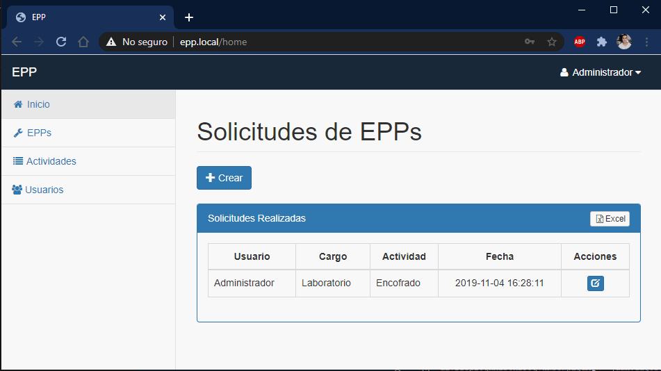

## Sistema para la gestión de EPPs

Este es un pequeño sistema desarrollado usando Laravel 5.8 y algo de Vue.js, el sistema permite gestionar los diferentes elementos de protección
requeridos dependiendo de la actividad que se vaya a realizar, el sistema permite editar y crear nuevos EPPs también permite registrar diferentes 
actividades  y asociar a dicha actividad los EPPs requeridos para que esta sea llevada acabo.

El sistema también permite crear usuarios de tipo operario y coordinador, el usuario coordinador será el administrador del sistema y podrá crear
 y editar EPPs actividades y usuarios, el usuario operador podrá crear solicitudes de EPPs, mediante la selección de la actividad a realizar,
 dichas ordenes podrán ser vistas por el coordinador y exportadas a un archivo excel.
 
Después de clonar y ubicarse dentro del proyecto Ejecutar:

- `composer install`
- `cp .env.example .env`

Crear BD y agregar credenciales en el archivo .env

* DB_HOST=localhost
* DB_DATABASE=tu_base_de_datos
* DB_USERNAME=root
* DB_PASSWORD=

- `php artisan key:generate`

Ejecutar Migraciones y sedders (Datos de prueba)

- `php artisan migrate --seed`

